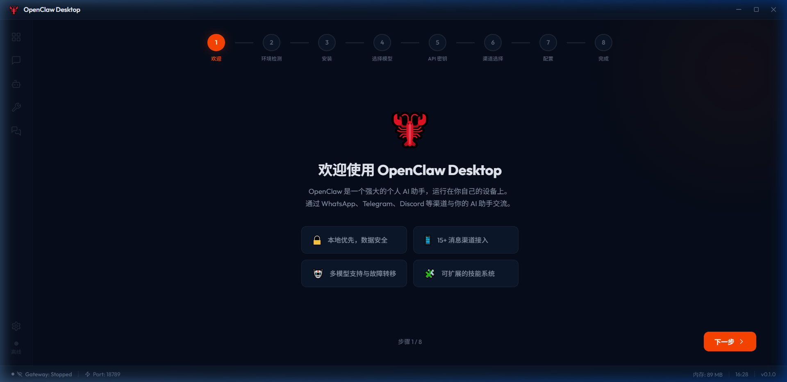
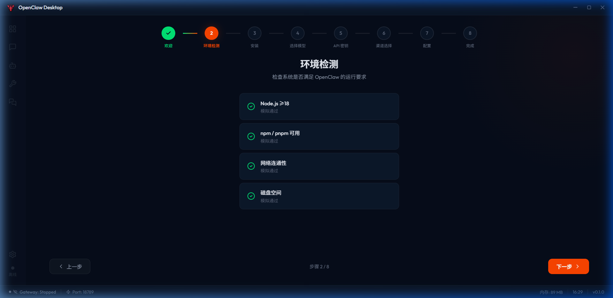
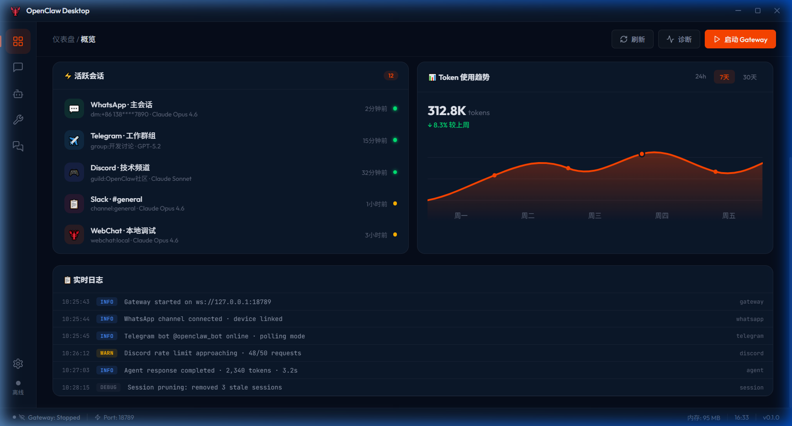
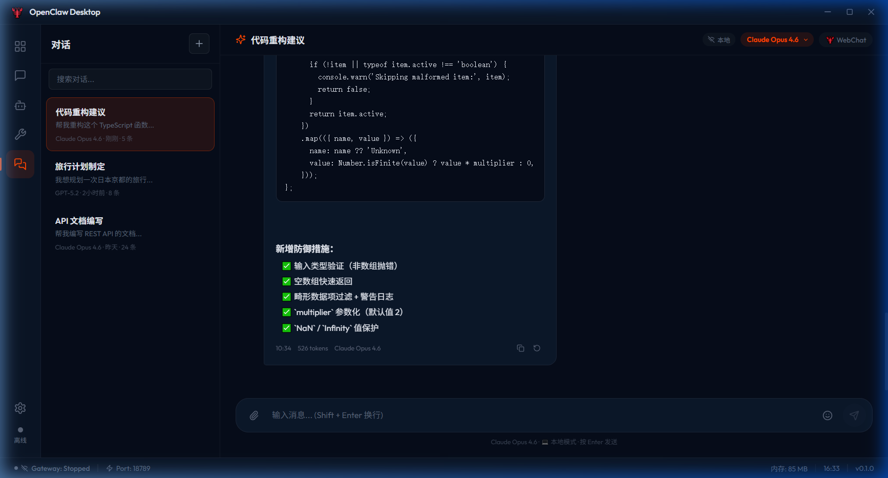
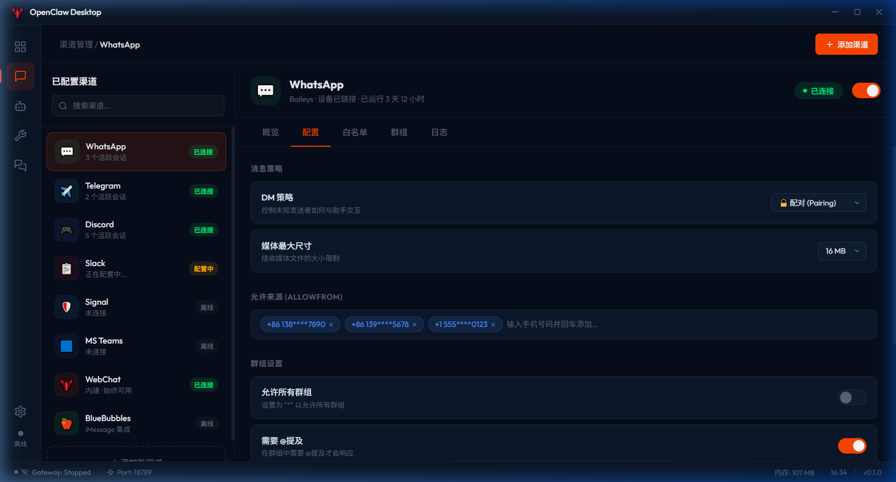
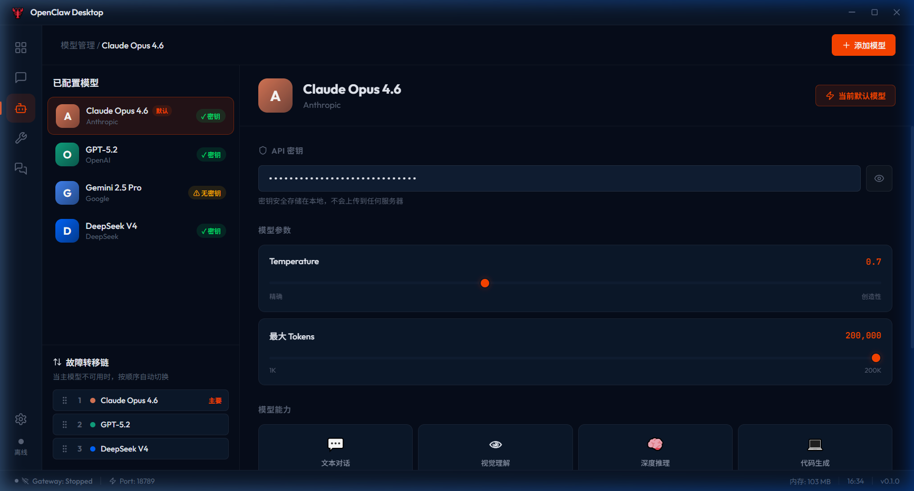
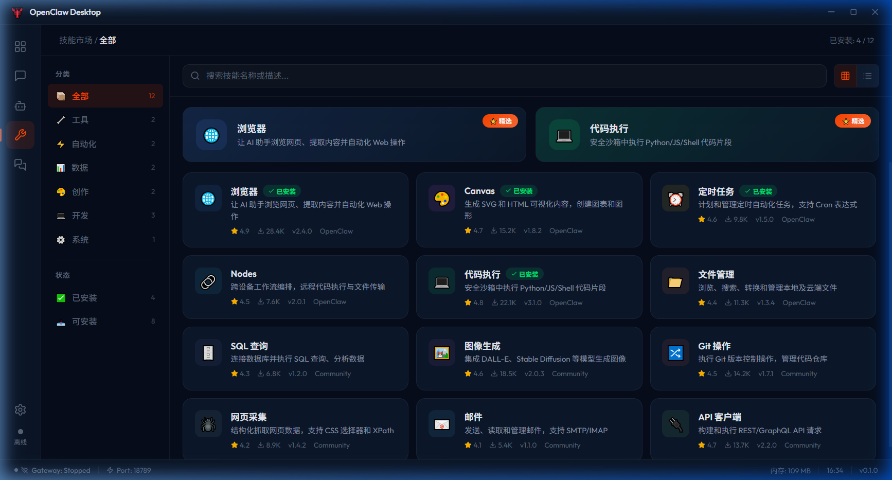
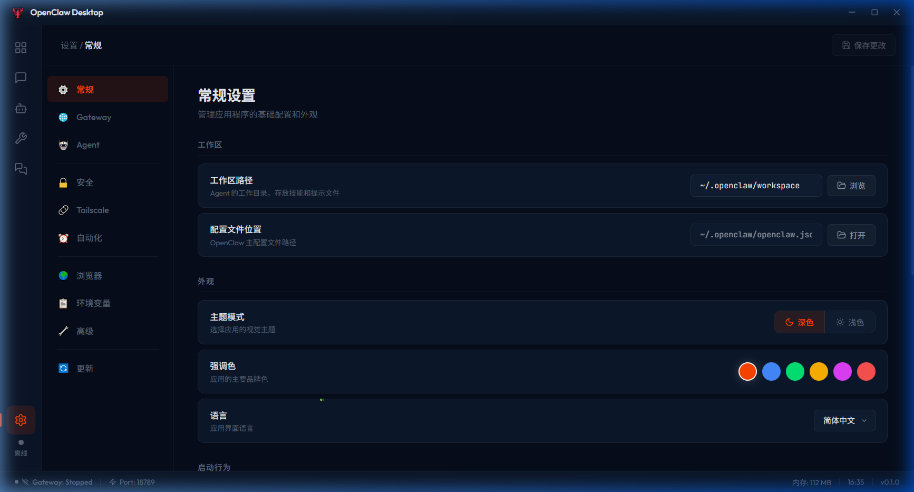

<div align="center">

# 🦞 OpenClaw Desktop

**可视化管理你的 AI 助手**

[](https://www.electronjs.org/)
[](https://react.dev/)
[](https://www.typescriptlang.org/)
[](https://vite.dev/)
[](LICENSE)

*将 OpenClaw 的全部 CLI 操作封装为现代化桌面 GUI 应用*

</div>

---

## 📖 项目简介

OpenClaw Desktop 是 [OpenClaw](https://github.com/nicepkg/openclaw) 的官方桌面客户端，将所有命令行操作封装为直观的图形界面，让非技术用户也能轻松管理 AI 助手。

### ✨ 核心特性

| 特性 | 描述 |
|------|------|
| 🎯 **引导安装向导** | 8 步向导式配置，从环境检测到渠道接入一气呵成 |
| 📊 **实时仪表盘** | Gateway 状态监控、活跃会话、Token 用量图表、实时日志流 |
| 📲 **渠道管理** | 8+ 消息平台统一管理（WhatsApp/Telegram/Discord/Slack 等） |
| 🤖 **模型管理** | 12+ AI 模型配置、API Key 管理、故障转移链编排 |
| 🧩 **技能市场** | 浏览、安装、管理 AI 技能，支持分类和评分 |
| 💬 **内嵌对话** | 流式打字效果、多会话管理、实时模型切换 |
| ⚙️ **配置中心** | 图形化编辑所有配置项，支持环境变量管理 |
| 📦 **跨平台打包** | Windows NSIS / macOS DMG / Linux AppImage |

---

## 🖼️ 界面预览

### 引导安装向导

首次启动时的图形化安装引导，包含环境检测、模型选择、API 密钥配置、渠道选择等 8 个步骤。





### 仪表盘

实时展示系统状态：活跃会话列表、Token 使用趋势图、Gateway 实时日志流。



### 内嵌对话

支持流式响应、多会话管理、模型实时切换、WebSocket 通信。



### 渠道管理

可视化管理 8+ 消息平台连接，包括白名单、DM 策略、配对审批。



### 模型管理

配置 AI 模型和 API Key，支持拖拽排序的故障转移链编排。



### 技能市场

浏览和安装 AI 技能，支持分类过滤、评分排序。



### 设置中心

图形化编辑全部配置项，包含环境变量编辑器。



---

## 🚀 快速开始

### 环境要求

- **Node.js** ≥ 18
- **npm** 或 **pnpm**
- **Git**

### 安装与运行

```bash
# 克隆仓库
git clone https://github.com/xiaoaoke/openclaw-win.git
cd openclaw-win

# 安装依赖
npm install

# 开发模式运行
npm run electron:dev

# 或仅启动前端预览
npm run dev
```

### 构建安装包

```bash
# 构建 Windows 安装包
npm run build:win

# 构建 macOS 安装包
npm run build:mac

# 构建 Linux 安装包
npm run build:linux
```

构建产物输出到 `release/` 目录。

---

## 🏗️ 技术栈

```
前端 UI 框架:      React 19 + TypeScript 5.x
桌面框架:          Electron 34
构建工具:          Vite 6 + vite-plugin-electron
状态管理:          Zustand
样式方案:          CSS Modules + CSS 变量 (设计系统)
图标:              Lucide Icons
WebSocket:         原生 WebSocket (连接 Gateway)
进程管理:          Node.js child_process
配置解析:          JSON5
打包分发:          electron-builder
```

---

## 📁 项目结构

```
openclaw-win/
├── electron/                    # Electron 主进程
│   ├── main.ts                 # 主进程入口
│   ├── preload.ts              # 预加载脚本 (IPC 桥接)
│   ├── ipc/handlers.ts         # IPC 路由注册
│   └── services/               # 后端服务
│       ├── gateway.ts          # Gateway 进程管理
│       └── config.ts           # 配置文件读写
├── src/                        # React 渲染进程
│   ├── App.tsx                 # 根组件 + 路由
│   ├── main.tsx                # 渲染进程入口
│   ├── components/layout/      # 布局组件
│   │   ├── Sidebar.tsx         # 侧边导航栏
│   │   ├── StatusBar.tsx       # 底部状态栏
│   │   └── Titlebar.tsx        # 自定义标题栏
│   ├── pages/                  # 页面组件
│   │   ├── Dashboard.tsx       # 仪表盘
│   │   ├── Chat.tsx            # 对话界面
│   │   ├── Channels.tsx        # 渠道管理
│   │   ├── Models.tsx          # 模型管理
│   │   ├── Skills.tsx          # 技能市场
│   │   ├── Settings.tsx        # 设置中心
│   │   └── Onboarding.tsx      # 引导向导
│   ├── hooks/                  # 自定义 Hooks
│   │   ├── useGateway.ts       # Gateway 连接管理
│   │   ├── useConfig.ts        # 配置读写
│   │   └── useWebSocket.ts     # WebSocket 通信
│   └── stores/appStore.ts      # Zustand 全局状态
├── design/                     # HTML 设计稿
├── screenshots/                # 界面截图
├── package.json
├── electron-builder.json5      # 打包配置
├── vite.config.ts              # Vite 配置
├── tsconfig.json
└── PLAN.md                     # 完整项目方案
```

---

## 🎨 设计规范

| 属性 | 规范 |
|------|------|
| **设计风格** | 现代扁平化 + 微玻璃态 (Glassmorphism) |
| **主题** | 深色模式为主，科技感强 |
| **主色调** | 🦞 龙虾红 `#FF4500` + 深海蓝 `#0A1628` |
| **强调色** | 翠绿 `#00E676` · 琥珀 `#FFB300` · 红 `#FF5252` |
| **字体** | Inter (UI) + JetBrains Mono (代码) |
| **图标** | Lucide Icons |
| **动效** | 状态切换 200ms ease，页面切换 300ms |

---

## 🔌 与 OpenClaw 的集成

GUI 通过三层方式与 OpenClaw 交互：

```
┌─────────────────────────────────────┐
│         OpenClaw Desktop GUI        │
├─────────────────────────────────────┤
│ 层1: WebSocket 直连 Gateway         │  ← 实时数据
│     ws://127.0.0.1:18789            │
├─────────────────────────────────────┤
│ 层2: CLI 命令封装                    │  ← 操作执行
│     child_process.spawn('openclaw') │
├─────────────────────────────────────┤
│ 层3: 配置文件直接读写                │  ← 配置管理
│     ~/.openclaw/openclaw.json       │
└─────────────────────────────────────┘
```

---

## 📝 开发路线

- [x] **Phase 1** — 项目搭建、设计系统、引导向导
- [x] **Phase 2** — 仪表盘、Gateway 管理
- [x] **Phase 3** — 渠道管理
- [x] **Phase 4** — 模型管理、配置中心
- [x] **Phase 5** — 真实数据集成、WebSocket 通信、UI 增强
- [x] **Phase 6** — Chat 流式对话、打包构建
- [ ] **Phase 7** — 内嵌终端 (xterm.js)、自动更新 (electron-updater)

---

## 🤝 贡献

欢迎提交 Issue 和 Pull Request！

---

## 📄 License

[MIT](LICENSE) © 2026 OpenClaw
